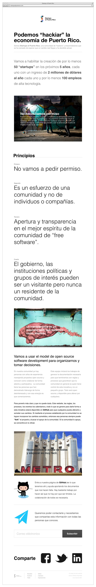

## Startups of Puerto Rico website
En este repositorio estará el código del website de Startups of Puerto Rico ([startupsofpuertorico.com](http://startupsofpuertorico.com)). La idea es que cualquiera de la comunidad pueda, ver, editar y colaborar en la creación de las reglas, procesos y principios que rigen nuestra comunidad.

### Concepto
En este momento nos encontramos dando los primeros pasos de este proyecto. Estamos tratando de definir la manera más efectiva de comunicar lo que expresamos en los [Founding Documents](https://github.com/SoPR/FoundingDocuments).

Aquí una idea general de lo que yo ([@gcollazo](http://twitter.com/gcollazo)) creo debe ser el site. Les pido que critiquen y mejoren a su gusto. He incluido todos los archivos necesarios para eso. Aquí les dejo un preview.

### Colaboraciones
Toda aportación es bienvenida. Diseño, copy, correcciones, ideas, procesos, reglas y todo lo demás que mencionamos en los [Founding Documents](https://github.com/SoPR/FoundingDocuments).

Si no sabes usar git y/o GitHub, deja un mensaje en el grupo de google y te ayudaremos a integrar tu aportación a este o cualquier otro repositorio de SoPR.

#### Herramientas
El logo de Startups of Puerto Rico está en formato Sketch y el diseño del site en formato OmniGraffle. Puedes usar lo que sea que tienes a la mano. Lo que importa es la aportación y no las herramientas.

